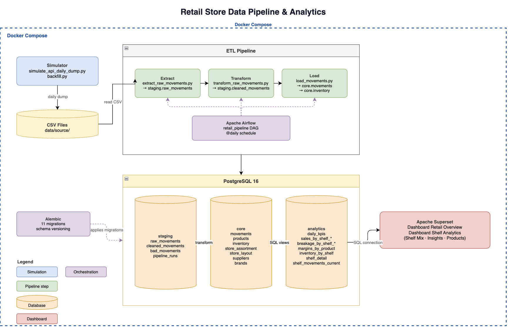
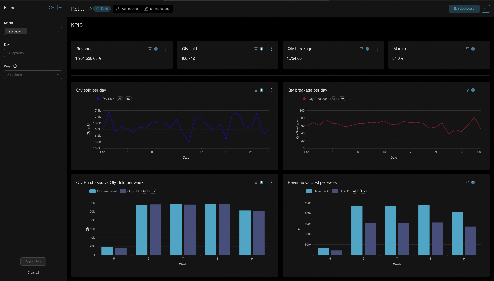
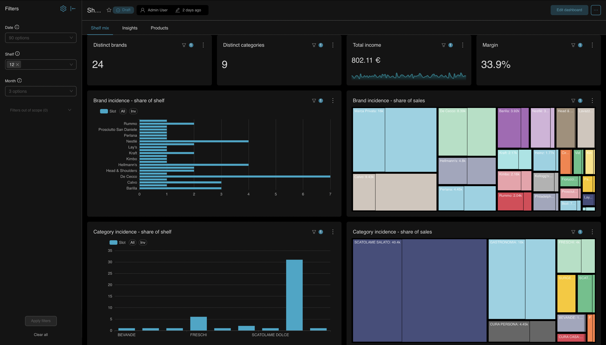
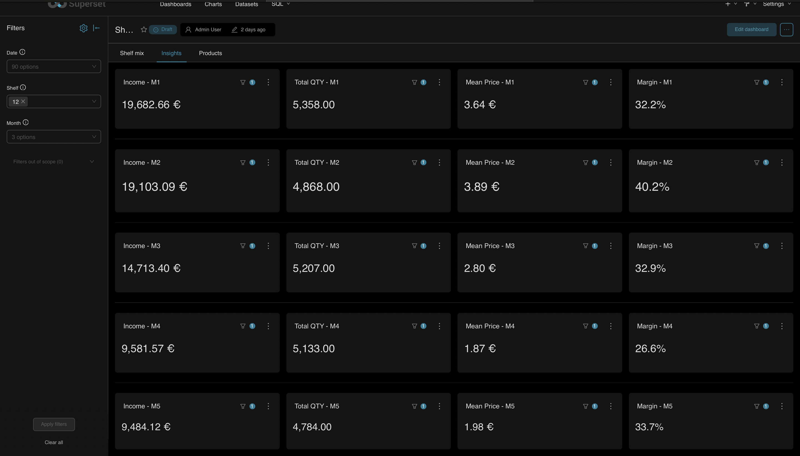
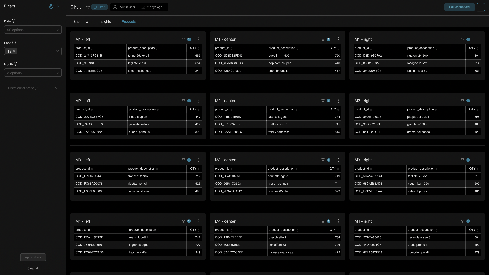

# Retail Store Data Pipeline & Analytics

Progetto portfolio end-to-end: simulazione dati operativi di un punto vendita, pipeline ETL completa, layer analytics e orchestrazione con dashboard interattiva. Dimostra competenze di data engineering su uno stack moderno.

---

## Architettura

Il progetto segue un'architettura a 4 layer con schemi PostgreSQL dedicati.



> Il file sorgente modificabile è disponibile in [`assets/architecture.drawio`](assets/architecture.drawio) — aprilo su [diagrams.net](https://app.diagrams.net).

- **`staging`** — dati grezzi dal CSV, nessun vincolo FK/CHECK (validazione delegata al transform)
- **`core`** — dati puliti, normalizzati, con vincoli di integrità referenziale
- **`analytics`** — view SQL pronte per il consumo BI, con colonne temporali pre-calcolate
- **`sim`** — parametri per la generazione dati sintetici (rotation class, spoilage probability, ecc.)

---

## Pipeline ETL

La pipeline è suddivisa in 3 step sequenziali, ciascuno **idempotente**:

### 1. Extract (`pipeline/extract/extract_raw_movements.py`)
- Scansiona `data/source/` e individua i file non ancora processati
- Carica in `staging.raw_movements` senza trasformazioni (raw as-is)
- Traccia i file in `staging.processed_files` per evitare duplicati

### 2. Transform (`pipeline/transform/transform_raw_movements.py`)
- Legge da `staging.raw_movements`
- Applica 6 regole di validazione (prodotto sconosciuto, fornitore mancante, prezzi incoerenti, ecc.)
- Output: `staging.cleaned_movements` (validi) + `staging.bad_movements` (scarti con motivo)

### 3. Load (`pipeline/load/load_movements.py`)
- Legge `staging.cleaned_movements` dove `loaded = FALSE`
- Arricchisce con posizione scaffale da `core.store_assortment` (**denormalizzazione storica**)
- Inserisce in `core.movements` e aggiorna `core.inventory` in singola transazione atomica
- Marca i record come `loaded = TRUE`

### Observability
Ogni step registra esecuzione, durata e righe processate/fallite in `staging.pipeline_runs` tramite il helper `RunTracker`.

---

## Analytics Layer

9 view SQL nel schema `analytics`, ottimizzate per il consumo diretto da tool BI.
Tutte le view con `movement_date` includono colonne pre-calcolate `month`, `year`, `week`.

| View | Descrizione |
|------|-------------|
| `daily_kpis` | KPI giornalieri: revenue, COGS, breakage cost, acquisti, rotture |
| `sales_by_shelf_historical` | Vendite per scaffale (posizione **al momento** della vendita) |
| `sales_by_shelf_current` | Vendite per scaffale (posizione **attuale** del prodotto) |
| `breakage_by_shelf_historical` | Rotture per scaffale (storico) con costo |
| `breakage_by_shelf_current` | Rotture per scaffale (assortimento attuale) |
| `margins_by_product_shelf` | Margini per prodotto/scaffale: revenue, COGS, margin, margin_pct |
| `inventory_by_shelf` | Stock attuale per posizione con fill percentage |
| `shelf_detail` | Dimensione scaffale: layout + prodotto + marca + categoria assegnati |
| `shelf_movements_current` | Movimenti non aggregati per posizione **attuale** — base per dashboard scaffale |

**Nota:** Le view `historical` usano `movements.shelf_id` (posizione al momento del movimento). Le view `current` usano `store_assortment.shelf_id` con `active_flag = TRUE` (posizione attuale).

---

## Dashboard (Apache Superset)

Il progetto include 2 dashboard distinte.

### Dashboard 1 — Retail Overview

Panoramica operativa del punto vendita. Filtri per mese, settimana e giorno (collegati tra loro).

- KPI principali: revenue, quantità venduta, rotture, margine
- Andamento temporale di vendite e costi
- Confronto tra quantità acquistate e vendute
- Rapporto ricavato / costo nel tempo

### Dashboard 2 — Shelf Analytics

Analisi dello scaffale selezionato, suddivisa in 3 tab:

- **Products** — fotografia scaffale: 15 mini-tabelle (5 livelli × 3 zone) con prodotti, venduto, giacenza e rotture per ogni posizione
- **Insights** — KPI per mensola: quantità, fatturato e margine aggregati per livello e zona
- **Shelf Mix** — analisi composizione scaffale: presenza marca/categoria (slot count), incidenza sul fatturato, correlazione spazio vs vendite

Filtri nativi cross-dataset: `shelf_id`, `month`, `year`, `week`.

---

## Risultati

> ⚠️ **I dati mostrati sono completamente sintetici e simulati.** Non si riferiscono a nessun punto vendita reale. Le dashboard sono esempi dimostrativi — metriche, filtri e visualizzazioni sono completamente personalizzabili in base alle esigenze.

### Dashboard 1 — Retail Overview



Panoramica operativa del punto vendita con filtri per mese, settimana e giorno (collegati tra loro). Mostra i KPI principali (revenue, quantità venduta, rotture, margine) e l'andamento temporale delle vendite e dei costi. Permette di confrontare quantità acquistate e vendute e di monitorare il rapporto tra ricavato e costo nel tempo.

---

### Dashboard 2 — Shelf Analytics

Seconda dashboard dedicata all'analisi per scaffale, suddivisa in 3 tab. I filtri permettono di selezionare scaffale, mese e data.

#### Tab 1 — Shelf Mix



Composizione dello scaffale selezionato: KPI sintetici (brand distinti, categorie, fatturato, margine), share of shelf e share of sales per marca e per categoria. Permette di confrontare quanto spazio occupa una marca/categoria rispetto a quanto contribuisce alle vendite.

#### Tab 2 — Insights



KPI per ogni mensola dello scaffale (M1–M5): fatturato, quantità venduta, prezzo medio e margine. Consente di identificare le mensole più performanti e quelle con margini più bassi, senza dover analizzare i dati prodotto per prodotto.

#### Tab 3 — Products



Fotografia dettagliata dello scaffale: per ogni combinazione di mensola e zona (left, center, right) viene mostrata una tabella con i prodotti presenti e la quantità venduta nel periodo selezionato. Permette di passare da un'analisi aggregata al dettaglio del singolo prodotto senza cambiare dashboard.

---

## Orchestrazione

**Apache Airflow** orchestra la pipeline con un DAG giornaliero:

```
extract >> transform >> load
```

- DAG: `retail_pipeline` (`dags/retail_pipeline_dag.py`)
- Schedule: `@daily`, `catchup=False`
- Deploy via Docker Compose con webserver, scheduler e metadata DB dedicato

---

## Schema Migrations

**Alembic** gestisce l'evoluzione dello schema (11 migration totali):

| Migration | Descrizione |
|-----------|-------------|
| `201a206eb191` | Baseline |
| `ad2b2eb4f887` | Rimozione FK/CHECK da staging.raw_movements |
| `3bf22fb601f1` | Trigger auto-update `updated_at` su inventory |
| `07c7eb570292` | Tabella `staging.pipeline_runs` |
| `ec8a1f10e303` | Colonna `updated_at` su inventory |
| `a1b2c3d4e5f6` | Creazione 8 view analytics |
| `b2c3d4e5f6a7` | Aggiunta `cogs` e `breakage_cost` a `daily_kpis` |
| `c3d4e5f6a7b8` | Aggiunta `month`, `year`, `week` a tutte le view |
| `d4e5f6a7b8c9` | Creazione view `shelf_movements_current` |
| `e5f6a7b8c9d0` | Aggiunta `brand_code` a `shelf_movements_current` |
| `f6a7b8c9d0e1` | Tabella `core.brands` + `brand_name` nelle view |

---

## Stack Tecnologico

| Componente | Tecnologia |
|------------|------------|
| Linguaggio | Python 3.12 |
| Database | PostgreSQL 16 |
| ORM / DB access | SQLAlchemy + psycopg2 |
| Data manipulation | Pandas |
| Migrations | Alembic |
| Orchestrazione | Apache Airflow 2.10 |
| Dashboard BI | Apache Superset |
| Containerizzazione | Docker + Docker Compose |
| Package management | pyproject.toml (editable install) |

---

## Struttura del Progetto

```
Retail/
├── alembic/                        # Schema migrations
│   ├── env.py
│   └── versions/                   # 11 migration files
│
├── dags/
│   └── retail_pipeline_dag.py      # Airflow DAG giornaliero
│
├── data/
│   ├── products_master.csv         # Anagrafica prodotti
│   ├── brands.csv                  # Anagrafica brand
│   ├── PriceList.csv               # Listino prezzi
│   └── source/                     # CSV movimenti giornalieri (output simulatore)
│
├── pipeline/
│   ├── extract/
│   │   └── extract_raw_movements.py
│   ├── transform/
│   │   └── transform_raw_movements.py
│   ├── load/
│   │   └── load_movements.py
│   └── run_tracker.py              # Helper observability (RunTracker)
│
├── scripts/
│   ├── simulate_api_daily_dump.py  # Generatore movimenti giornalieri
│   ├── backfill.py                 # Backfill day-by-day (simulate + pipeline)
│   ├── load_products_master.py     # Caricamento anagrafica prodotti
│   ├── load_suppliers.py           # Caricamento fornitori
│   ├── load_product_suppliers.py   # Relazioni prodotto-fornitore
│   ├── load_brands.py              # Caricamento anagrafica brand
│   ├── generate_store_layout.py    # Generazione layout scaffali
│   ├── generate_store_assortment.py
│   ├── generate_products_specifications.py
│   └── init_inventory.py
│
├── sql/
│   ├── 01_create_schemas.sql
│   ├── 02_create_tables_core.sql
│   ├── 03_create_tables_sim.sql
│   ├── 04_create_tables_staging.sql
│   ├── 05_create_tables_core_movements.sql
│   ├── 06_create_tables_staging_validation.sql
│   ├── 07_create_tables_staging_pipeline_runs.sql
│   └── 08_create_views_analytics.sql
│
├── superset/
│   ├── Dockerfile                  # Immagine custom con psycopg2
│   └── bootstrap.sh                # Init: db migrate + admin user
│
├── src/
│   └── db.py                       # Engine factory (get_db_engine)
│
├── notebook/
│   └── mod_data.ipynb
│
├── Dockerfile.airflow
├── docker-compose.yaml             # PostgreSQL + Airflow + Superset
├── pyproject.toml
├── requirements.txt
├── alembic.ini
└── .env                            # Credenziali DB (non versionato)
```

---

## Come Eseguire il Progetto

### 1. Prerequisiti

```bash
git clone https://github.com/Domenico199/Retail-pipeline-dashboard.git
cd Retail-pipeline-dashboard
cp .env.example .env   # configura le credenziali DB
pip install -e .
```

### 2. Avvio database

```bash
docker compose up -d postgres
```

### 3. Creazione schema e tabelle

```bash
psql -h localhost -p 5434 -U retail_user -d retail -f sql/01_create_schemas.sql
psql -h localhost -p 5434 -U retail_user -d retail -f sql/02_create_tables_core.sql
psql -h localhost -p 5434 -U retail_user -d retail -f sql/03_create_tables_sim.sql
psql -h localhost -p 5434 -U retail_user -d retail -f sql/04_create_tables_staging.sql
psql -h localhost -p 5434 -U retail_user -d retail -f sql/05_create_tables_core_movements.sql
psql -h localhost -p 5434 -U retail_user -d retail -f sql/06_create_tables_staging_validation.sql
psql -h localhost -p 5434 -U retail_user -d retail -f sql/07_create_tables_staging_pipeline_runs.sql
```

### 4. Caricamento master data

```bash
python -m scripts.load_products_master
python -m scripts.load_suppliers
python -m scripts.load_product_suppliers
python -m scripts.load_brands
python -m scripts.generate_store_layout
python -m scripts.generate_store_assortment
python -m scripts.generate_products_specifications
python -m scripts.init_inventory
```

### 5. Applicazione migrations (schema + analytics views)

```bash
alembic upgrade head
```

### 6. Backfill dati storici

```bash
python -m scripts.backfill --start 2026-01-01 --end 2026-03-31
```

### 7. Avvio stack completo (Airflow + Superset)

```bash
docker compose up -d
```

- **Airflow**: http://localhost:8080 (admin/admin)
- **Superset**: http://localhost:8088 (admin/admin)

Per collegare Superset al DB, usa `host=postgres`, `port=5432`, `db=retail`, `user=retail_user`.

---

## Scelte di Modellazione

### Prezzi statici
Nel modello reale, costo e prezzo variano nel tempo (SCD Type 2). In questo progetto sono statici in `core.products`. Il prezzo effettivo delle vendite (incluse promo) è comunque tracciato in `core.movements.unit_sale_price`, garantendo l'accuratezza del calcolo dei margini.

### Denormalizzazione posizione scaffale
`core.movements` include `shelf_id`, `shelf_level`, `zone`, `slot_number` copiati da `store_assortment` al momento del load. Questo permette analisi storiche accurate anche se un prodotto viene spostato di scaffale (tracking storico vs assortimento attuale).

### Raw layer senza vincoli
`staging.raw_movements` non ha FK né CHECK constraint: i dati arrivano as-is e la validazione avviene nel transform step, separando nettamente ingestion da data quality.

### View current vs historical
Le view `*_current` attribuiscono i movimenti alla posizione **attuale** del prodotto (utile per analisi operative). Le view `*_historical` usano la posizione al **momento del movimento** (utile per analisi storiche precise).

---

## Limitazioni e Possibili Evoluzioni

### Limitazioni attuali
- Prezzi non storicizzati (no SCD Type 2)
- Single-store (predisposto multi-store con `store_id`)
- Assortimento statico (no SCD su `store_assortment`)
- No real-time streaming
- Inventory senza gestione lotti

### Possibili evoluzioni
- Storico prezzi e assortimento (SCD Type 2)
- Multi-store
- Streaming con Kafka
- Deploy cloud (AWS/Azure)
- Data quality checks avanzati (Great Expectations)


## Autore

**Domenico Serino**

Progetto realizzato a scopo portfolio Data Engineering.
